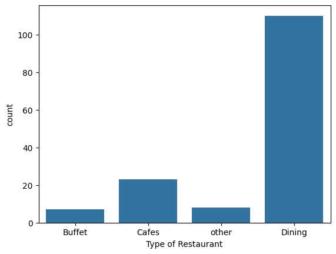
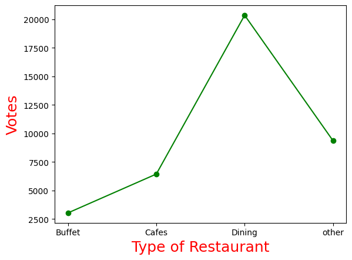
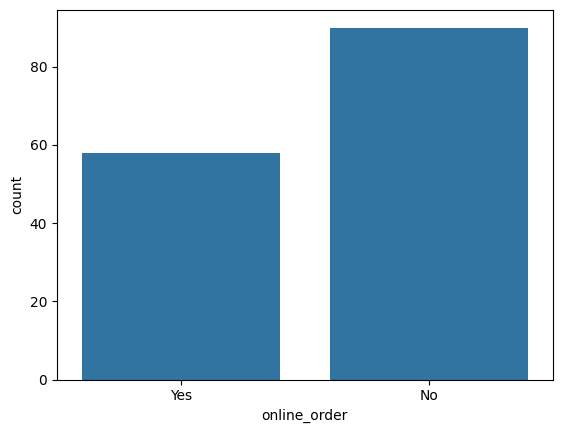
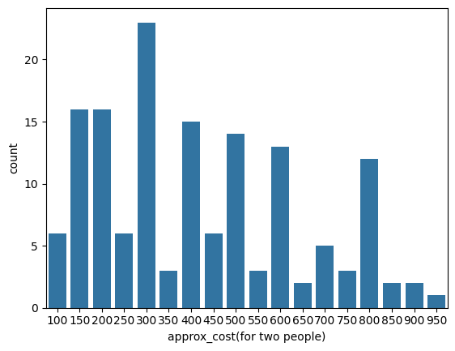
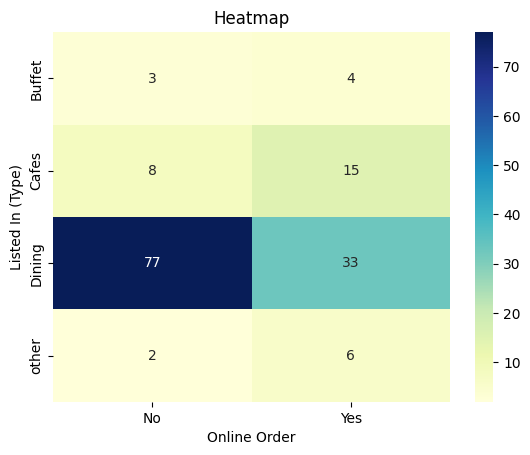

# **Zomato Data Analysis using Python**

Here we used Python and the standard open source libraries are used to analyze and visualize the zomato data.

### Following libraries are used in this project:

* Pandas
* Numpy
* Matplotlib
* Seaborn

These libraries are helpful to analyze the data and it open source and make our task eazyy to do...


### What insight gonna find?

Data analysis is done to provide answer for the question that drive to find insight to make data driven decision to make on given data.

So, here we have few questions to answer with our data insight...

1. What kind of restaurants category are there in zomato and leading category?
2. Weather does the restaurant will receive online orders or not?
3. How much does the couple spend on restaurant and average amount spend by couple?
4. Does restaurant or cafes have highest number of online order?

These question are answer usign the zomato data with analysis and visualization.


### Insight

To answer the raised questions using the given [Zomato-Data](https://github.com/kungumasakthivel/Zomato-Data-Analysis/blob/main/Zomato%20data%20.csv) 

1. What kind of restaurants category are there in zomato and leading category?

    

    The above image show the type of restaurant with its count. Here we find that**Dining** type of restaurants have highest number of restaurants.

    

    To answer the leading category we used**votes** column in [Zomato-Data](https://github.com/kungumasakthivel/Zomato-Data-Analysis/blob/main/Zomato%20data%20.csv) to find favourate category which is dining type of restaurant.

1. Weather does the restaurant will receive online orders or not?

    

    Here we see that**~60** restaurant will provide **online service** and **~90** restaurant will **not provide online service**.

1. How much does the couple spend on restaurant and average amount spend by couple?

    

    Here we see maximum couple spend around 300

```python
sum_of_cost_couple_data = couple_data.sum()
avg_of_cost_couple_data = sum_of_cost_couple_data / couple_data.count()
print(avg_of_cost_couple_data) #418.2432432432432
```

    The above code is used to calculate the average amount spend by couple in restaturant which is around 418.24 aprox.

1. Does restaurant or cafes have highest number of online order?

    

    Visualizing the heatmap provides various insight in one-go but it bit different to observe information annoting the data while generating heatmap provides the count in its place. So, it is easy to see the count on top of it.

Here, we see that maximum no. of restaurant will not provide online orders and while calculating the cafes count maximum no. of cafes providing online services.


Thanks || )
